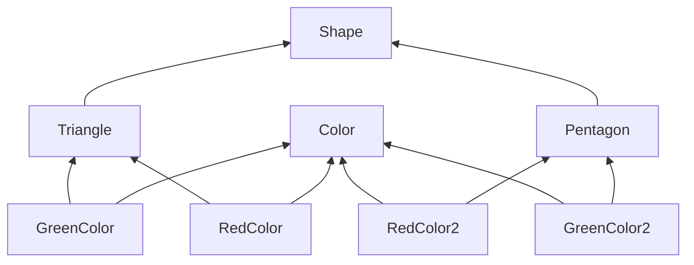
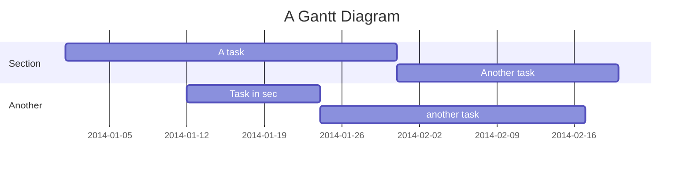

fsa
d
s
a
fd

dsa

```mermaid
graph BT
	Triangle-->Shape;
	Pentagon-->Shape;
	
	GreenColor-->Triangle;
	GreenColor-->Color;
	RedColor-->Triangle;
	RedColor-->Color;

	RedColor2-->Color;
	RedColor2-->Pentagon;
	GreenColor2-->Color;
	GreenColor2-->Pentagon;
	
	
```

s

```mermaid
gantt
    title A Gantt Diagram
    dateFormat  YYYY-MM-DD
    section Section
    A task           :a1, 2014-01-01, 30d
    Another task     :after a1  , 20d
    section Another
    Task in sec      :2014-01-12  , 12d
    another task      : 24d
```

